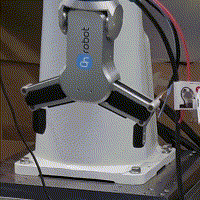

# onrobot-rg

[](https://opensource.org/licenses/MIT)


Controller for OnRobot RG2 and RG6 grippers.

## Requirements

- Python 3.7.3
  - pymodbus==2.5.3

## Installation

```bash
git clone git@github.com:takuya-ki/onrobot-rg.git && cd onrobot-rg && pip install -r requirements.txt
```

## Usage

1. Connect the cable between Compute Box and Tool Changer.
2. Connect an ethernet cable between Compute Box and your computer.
3. Execute a demo script as below  
```bash
python src/demo.py --ip 192.168.1.1 --port 502 --gripper rg2
```
```bash
python src/demo.py --ip 192.168.1.1 --port 502 --gripper rg6
```

  

## Author / Contributor

[Takuya Kiyokawa](https://takuya-ki.github.io/)

## License

This software is released under the MIT License, see [LICENSE](./LICENSE).
